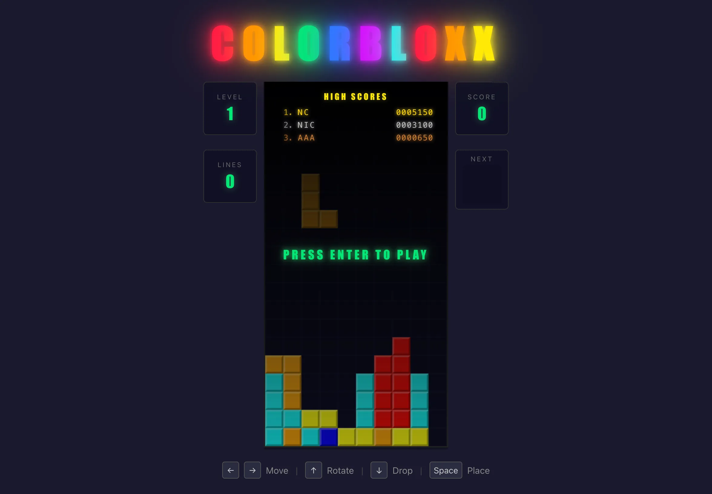

# COLORBLOXX



## We started with this:

> As a test project I'd like to implement a browser game "COLORBLOXX". Four random shapes (square (2x2), bar (4x1), z (2x1 above 2x1), T (3x1 with a 1x foot). Game starts when user presses a start button, left right arrow moves, up arrow rotates, space mirrors, down arrow drops. Points based on 1,2,3,4 lines erased (50, 100, 200, 500 points). Speed increase every 1000 points. When reaches top gameover, prompt for initials, show highscores list, option to play again.

## Then [Exponential](https://github.com/palarix/exponential) took over.

A single prompt turned into a fully playable browser COLORBLOXX game through iterative development tracked by [Exponential (xpo)](https://github.com/palarix/exponential) — a collaborative human-agent product engineering system that lives in your repo.

### Following the build process

Every commit in this repo maps to an xpo issue. You can follow how the game evolved in two ways:

**Via git log** — each commit message describes what changed and why:

```
git log --oneline --reverse
```

**Via the xpo board** — the `.xpo/` directory contains the full issue history: epics, stories, specs, walkthroughs, and comments. Each issue has:

- A **spec** (`.xpo/artifacts/<id>/spec.md`) written before implementation — the design decisions, acceptance criteria, and trade-offs
- A **walkthrough** (`.xpo/artifacts/<id>/walkthrough.md`) written after — how the code works, explained for a future reader
- **Comments** summarizing what changed and why

Browse them with the `xpo` CLI (`xpo list`, `xpo show <id>`) or just read the markdown files directly.

### The evolution

The game was built story by story, each one adding a layer:

1. **Scaffolding** — React + TypeScript + Vite + HTML5 Canvas
2. **Board rendering** — data-driven grid with beveled 3D tiles
3. **Piece definitions** — all 7 classic tetrominoes with rotation states
4. **Movement & collision** — keyboard input, wall detection, gravity
5. **Start screen** — idle state with Start button (later replaced with attract mode)
6. **Lock delay** — 500ms window to slide pieces after landing
7. **Soft drop & hard drop** — down arrow accelerates, space bar instant-locks
8. **Rotation** — clockwise rotation with wall kicks
9. **Line clearing** — detect and remove full rows
10. **Scoring & levels** — points per line clear, speed ramp every 1000 points
11. **Game over** — top-out detection, initials prompt
12. **High scores** — localStorage persistence, retro arcade leaderboard (gold/silver/bronze)
13. **Layout polish** — 3-column design, symmetric stat panels
14. **Next piece preview** — upcoming piece shown in side panel
15. **Ghost piece** — drop shadow (feature-flagged via localStorage)
16. **Attract mode** — AI plays COLORBLOXX on the start screen with placement heuristic
17. **Sound effects** — 8-bit chiptune sfx via Web Audio API (move, rotate, drop, lock, line clear celebrations, game over)
18. **Background music** — attract theme + "In the Hall of the Mountain King" gameplay loop with tempo scaling
19. **Line clear animations** — tiered effects: flash, color brighten, particles, lightning + "COLORBLOXX!" text
20. **Board shake** — screen shake on line clears, scaled by lines cleared
21. **Piece lock flash** — brief white flash when a piece locks
22. **Full-page celebrations** — sparkles, streaks, and firework bursts across the viewport on line clears

Along the way, bugs were filed, fixed, and tracked — layout shifts, double hard drops, animation delays — all visible in the issue history.

## Running the game

```
bun install
bun run dev
```

Open [http://localhost:5173](http://localhost:5173) and press Enter to play.

### Controls

| Key | Action |
|-----|--------|
| ← → | Move piece left/right |
| ↑ | Rotate clockwise |
| ↓ | Soft drop (hold to accelerate) |
| Space | Hard drop (instant lock) |

### Feature flags

Set in the browser console, refresh to apply:

```js
localStorage.setItem("showGhosts", "true")  // show drop shadow ghost piece
localStorage.setItem("muteSound", "true")   // mute sound effects
localStorage.setItem("muteMusic", "true")   // mute background music
```
